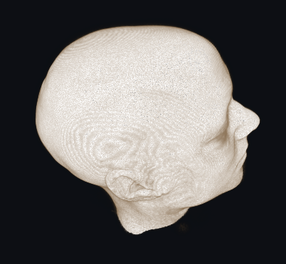

# NeuroPath

Planificador de trayectorias neuroquirúrgicas, construido para el desafío de XR Engineer de Navian sobre la escena base provista (Unity 6, UnityVolumeRendering y el atlas MRI IXI025).

La idea fue pasar de un visor a una herramienta de planificación. Además de explorar la anatomía —capas, cortes, ventana/nivel—, se traza una trayectoria de abordaje (entrada, blanco, profundidad) y el sistema responde la pregunta que importa en la práctica: si esa trayectoria cruza un vaso o no. Todo desde una UI flotante estilo XR que se opera con el mouse, y con las medidas en milímetros reales.



*(Pendiente: un GIF corto de la demo en `docs/images/` mostrando el corredor de seguridad, la craniotomía y los cortes 2D.)*

## Índice

1. [Cómo ejecutarlo](#cómo-ejecutarlo)
2. [Qué construí](#qué-construí)
3. [Controles](#controles)
4. [Decisiones técnicas](#decisiones-técnicas)
5. [Estructura del código](#estructura-del-código)
6. [Limitaciones conocidas](#limitaciones-conocidas)
7. [Qué mejoraría con más tiempo](#qué-mejoraría-con-más-tiempo)
8. [Dataset](#dataset)
9. [Troubleshooting](#troubleshooting)
10. [Licencia y créditos](#licencia-y-créditos)

## Cómo ejecutarlo

- Unity **6000.4.0f1** (Unity 6), esa versión exacta. Desde Unity Hub: *Add* → carpeta del repo.
- Render pipeline **Built-in**; no requiere setup extra.
- Escena: [`Assets/NavianChallenge/Scenes/NavianChallenge_Main.unity`](Assets/NavianChallenge/Scenes/NavianChallenge_Main.unity).

Abrís la escena y le das Play. Un único componente `NeuroPathBootstrap` presente en la escena arma toda la app en runtime: encuentra el atlas, monta la cámara, la UI world-space, el planner y el resto. La primera vez hay un hitch de uno o dos segundos mientras se genera la textura 3D de la MRI en la GPU; es normal.

El desafío se evalúa desde Desktop / Unity Editor, así que no hace falta ningún headset.

## Qué construí

Partí de la escena base —la MRI renderizada con UnityVolumeRendering y las cuatro mallas de segmentación (piel, sustancia gris, sustancia blanca, venas)— y agregué lo siguiente.

**Exploración de la anatomía.** Control por estructura (`AtlasLayers`, `LayerPanel`): opacidad, mostrar/ocultar, aislar una y atenuar el resto, y edición de color RGB. Las mallas vienen todas blancas, así que arrancan con colores por defecto legibles (venas en rojo, gris azulado, blanca crema, piel en tono piel) y de ahí se ajustan en vivo. Para el volumen (`VolumeController`, `MriPanel`): visibilidad, modo de render DVR / MIP / Isosurface, y window/level para esconder la piel y el aire y ver el interior.

**Cortes.** Un plano de clipping deslizable (`CrossSectionController`) en los tres ejes anatómicos que corta el volumen y las mallas a la vez. Una craniotomía (`CraniotomyController`, `CraniotomyPanel`) que abre una ventana en la cabeza para exponer lo de abajo, redonda por defecto —como una craniotomía real— o de caja, ubicable en los tres ejes y con tamaño en milímetros. Y un explorador MPR (`MprController`, `MprPanel`) con los tres cortes 2D en escala de grises extraídos del volumen, con un crosshair sincronizado entre los tres cortes y un marcador en el 3D: clickeás en un corte y ves el punto en la escena tridimensional.

**Planificación.** El planner de trayectoria (`TrajectoryPlanner`, `ReadoutPanel`) deja colocar blanco y entrada, con la línea y los handles arrastrables, y muestra longitud de inserción, ángulo de abordaje y coordenadas en milímetros. Sobre eso corre el corredor de seguridad (`SafetyCorridor`): un cilindro del radio que elijas alrededor de la trayectoria, testeado en tiempo real contra la malla de venas, que da CLEAR (verde) o WARNING (rojo). Es la pieza que le da propósito real al objeto de venas y la que convierte al proyecto de visor en herramienta de decisión.

**Interacción.** Los paneles son world-space, anclados a la cámara y operados por raycast desde el mouse, con una retícula sobre la superficie. Toda la UI se construye en código. La cámara (`CameraOrbit`) hace órbita, zoom y pan, sin orbitar cuando arrastrás sobre un panel.

Los cinco botones del panel de herramientas funcionan; no quedaron placeholders. Entre todo esto se cubren las cuatro ideas que sugería el brief: explorador de cortes 2D, interfaz XR con raycast, inspección con clipping y crop, y comparación entre lo volumétrico y los planos 2D.

## Controles

Cámara, en cualquier modo:

| Acción | |
|---|---|
| Arrastrar con botón derecho | Orbitar |
| Rueda | Zoom |
| Arrastrar con botón medio | Pan |
| `R` | Resetear la cámara |

El botón izquierdo orbita solo en modo Explore; en las demás herramientas el izquierdo pertenece a la herramienta activa (para colocar puntos sin que la cámara se mueva), y el derecho sigue orbitando.

Herramientas (panel derecho):

- **Explore**: solo inspección.
- **Slices**: aparece la franja de cortes 2D abajo; clic o arrastre sobre un corte mueve el crosshair, y el window/level del panel MRI los re-windowea en vivo.
- **Plan trajectory**: primer clic el blanco, segundo clic la entrada; los handles se arrastran, y hay sliders de profundidad y de radio del corredor.
- **Measure**: dos clics para medir distancia en milímetros; los extremos se arrastran y un clic más reinicia.
- **Craniotomy**: abre la ventana, con toggle redonda/caja, posición en los tres ejes y tamaño en milímetros.

## Decisiones técnicas

### Todo se ensambla en runtime desde un solo componente

La escena base genera el volumen MRI en runtime y no lo serializa en el `.unity`. En vez de cablear la app en el inspector, `NeuroPathBootstrap` la arma entera por código en `Start()` y auto-encuentra los objetos por nombre. Así el diff sobre la escena base queda en un único componente agregado, no hay referencias que se pierdan en el editor, y toda la app se entiende leyendo el código en lugar de cazando enlaces en la escena.

### Un único lugar tiene el modo activo

Hay un enum `Tool` (Explore, Slices, PlanTrajectory, Measure, Craniotomy) que vive en `AppState`, con un evento cuando cambia. Cada sistema lee el modo de ahí y nadie más lo guarda. Sin esto, la cámara, el planner, el measure y la craniotomía competirían por el mismo clic izquierdo. Con un solo origen del modo el input queda sin ambigüedad: el planner solo responde en su modo, el measure en el suyo, y agregar una herramienta nueva no rompe las anteriores. Por la misma razón la cámara cede el botón izquierdo fuera de Explore, y el controller de cámara base quedó deshabilitado para que no lo manejen dos scripts a la vez.

### Una unidad de Unity es un milímetro

La escena mapea el FOV físico de la MRI (240 × 240 × 180 mm sobre 256 × 256 × 150 voxels) a unidades de mundo 1:1. Las medidas clínicas tienen que ser reales, no arbitrarias, así que la longitud de inserción, el ángulo, las coordenadas, el radio del corredor y el tamaño de la ventana de craniotomía están todos en milímetros de verdad.

### UI world-space operada por raycast

Los paneles son canvases en world-space anclados a la cámara y se tocan por raycast desde el mouse. Es la interacción de paneles flotantes que muestra el propio brief en su mockup, pero resuelta desde desktop. Al estar anclados a la cámara quedan legibles y alcanzables sin importar cómo orbites, y el resultado se siente como un navegador quirúrgico y no como un HUD 2D pegado a la pantalla.

### Un shader propio para cortar las mallas junto con el volumen

Las mallas base eran Standard opacas. Las pasé a un shader propio, alpha-blended y de doble cara, que además descarta fragmentos por plano, caja o esfera según globals de shader. Necesitaba dos cosas que el Standard no daba: opacidad por estructura para ver el interior, y que las mallas se corten con exactamente el mismo plano o forma que el volumen. El shader replica la matemática de cutout de UnityVolumeRendering (la misma matriz de mundo a espacio local y el mismo criterio de "dentro se descarta"), de modo que el volumen y las superficies se cortan como una sola cosa. Tanto el corte plano como la craniotomía carvan los dos a la vez; un corte que dejara las mallas opacas tapando el interior no serviría.

### El corredor de seguridad por muestreo de esferas

El test recorre el segmento entrada–blanco en esferas solapadas (`OverlapSphere`, con paso igual a la mitad del radio) y pregunta si alguna toca el collider de venas. La malla de venas es no-convexa, así que `ClosestPoint` o un capsule cast no funcionan directo contra ella; el muestreo de esferas sí, es simple y es suficientemente preciso. Es un compromiso consciente: da un veredicto binario, no una distancia exacta al vaso, e ignora el grosor real y el margen clínico.

### El MPR se extrae en CPU desde la data cruda

Los tres cortes se sacan del arreglo de densidades del dataset a una `Texture2D` en escala de grises, aplicando el mismo window/level que el volumen 3D. Sale de la data cruda (antes de la transfer function de color), que es como se leen los cortes en clínica; es autocontenido, sin RenderTextures ni shaders extra; y comparte la ventana con el 3D por polling. La re-extracción es lazy, un plano por eje que cambia, para que arrastrar el crosshair sea fluido. El marcador 3D usa el mismo frame que la craniotomía, así el crosshair 2D y el punto en la escena son el mismo voxel.

## Estructura del código

Todo lo propio vive en `Assets/NavianChallenge/`:

```
Scenes/NavianChallenge_Main.unity     escena principal
Shaders/ClippedSurface.shader         corte de mallas (plano, caja y esfera)
Scripts/
  Core/
    AppState.cs                       origen único del modo (enum Tool)
    NeuroPathBootstrap.cs             ensambla la app en runtime
  Interaction/
    CameraOrbit.cs                    órbita/zoom/pan, consciente de UI y modo
    PointerRaycaster.cs               retícula y picking desde el mouse
  UI/
    UIFactory.cs, UITheme.cs          helpers y estilo compartido
    MriPanel.cs, LayerPanel.cs
    ToolPanel.cs, CraniotomyPanel.cs
    ReadoutPanel.cs                   readout del planner
    MprPanel.cs, SliceView.cs         cortes 2D y su picking
  Atlas/
    VolumeController.cs               wrapper de UVR (render mode, window)
    AtlasLayers.cs                    opacidad/color/aislado de estructuras
    CrossSectionController.cs         plano de corte (volumen + mallas)
    CraniotomyController.cs           cutout de caja/esfera
    MprController.cs                  extracción de cortes + marcador 3D
  Planning/
    TrajectoryPlanner.cs              blanco/entrada, métricas
    SafetyCorridor.cs                 test cilindro contra venas
    MeasureTool.cs                    regla de dos puntos
```

Las librerías de terceros (UnityVolumeRendering, Nifti.NET, openDicom) están en `Assets/ThirdParty/` y no se tocaron, salvo silenciar un par de logs informativos.

## Limitaciones conocidas

- Al cargar la escena aparece un error rojo en consola (*"Cannot destroy GameObject…"*) que viene del `AtlasVolumeLoader` de la escena base. No lo toqué porque es de la infraestructura base y no de NeuroPath, y no afecta el funcionamiento; preferí dejarlo a la vista antes que enmascarar algo que no escribí.
- El corredor de seguridad es binario (CLEAR / WARNING), no da la distancia exacta al vaso más cercano, ignora el grosor real de la vena y no aplica margen clínico. El muestreo es de esferas, no una cápsula barrida exacta.
- Con varias mallas transparentes superpuestas y sin depth-write puede haber artefactos leves de ordenamiento en superficies cóncavas. Un pase de depth-peeling u OIT lo resolvería.
- Los cortes MPR se extraen en el orden crudo del dataset, no forzados a convención radiológica, así que alguno puede verse rotado o espejado respecto de la orientación clínica; la navegación entre cortes y con el 3D sí es consistente. El crosshair muestrea el voxel más cercano, sin interpolación.
- El blanco de la trayectoria es un punto sobre la superficie empujado a una profundidad ajustable, no el centroide de una lesión (el atlas no trae una lesión a la cual snapear). Se planifica una sola trayectoria por vez, sin comparación ni scoring.
- La UI se reconstruye en runtime y no intenta sobrevivir a un domain reload en medio del Play.

## Qué mejoraría con más tiempo

- MPR más completo: orientación radiológica correcta, la trayectoria proyectada sobre los tres cortes, scroll para barrer, y muestreo interpolado.
- Corredor con clearance real en milímetros más margen clínico, y la línea de la trayectoria pintada de verde o rojo según el veredicto.
- Varias trayectorias comparables con un score simple entre longitud, clearance y ángulo.
- Pulido: que la UI sobreviva a domain reloads, se re-ubique al cambiar el aspect ratio, y un readout más compacto. También un `.gitignore` de Unity para dejar el repo más limpio.
- Como dirección de producto: DTI y tractografía para evitar tractos elocuentes, fMRI de áreas funcionales, registro paciente–imagen, fusión CT+MRI, y llevar la misma UI a XR real en Quest, que es hacia donde ya está pensada la interacción.

## Dataset

MRI `IXI025` T1, 256 × 256 × 150 voxels, FOV 240 × 240 × 180 mm. Cuatro mallas: sustancia gris, sustancia blanca, venas y piel. Los datos viven dentro del proyecto (`Assets/NavianChallenge/Data/Atlas/IXI025/`), así que el repo es autocontenido.

## Troubleshooting

- *«Recovering Scene Backups» al abrir*: es la auto-recuperación de Unity por un cierre previo no limpio. Podés darle No; la escena del repo es la buena.
- *Hitch de uno o dos segundos al abrir la escena o recompilar*: es la generación de la textura 3D de la MRI. Normal.
- *No se ve la MRI en modo edición*: seleccioná `AtlasRig` → `AtlasVolumeLoader` → clic derecho → Rebuild Volume.
- *Consola limpia*: `Assets/csc.rsp` silencia warnings de API deprecada de UnityVolumeRendering (código de terceros); borralo si querés verlos en tu propio código.
- *Aviso de Input Manager*: la escena usa el Input Manager clásico por simplicidad. Unity sugiere migrar al Input System package; es opcional.
- *Los cortes MPR se ven planos o blancos*: ajustá Window min/max en el panel MRI; la ventana por defecto puede estar muy abierta.

## Licencia y créditos

- Código propio del desafío (escena, `Assets/NavianChallenge/`, esta documentación): MIT © Navian — ver [`LICENSE`](LICENSE).
- Librerías de terceros (mantienen su propia licencia): UnityVolumeRendering (MIT), Nifti.NET (MIT), openDicom (LGPL). Detalle en [`THIRD-PARTY-NOTICES.md`](THIRD-PARTY-NOTICES.md).
- Dataset: la MRI IXI025 y los meshes derivados están bajo CC BY-SA 3.0, con crédito al proyecto [IXI](https://brain-development.org/ixi-dataset/). Si redistribuís la data o trabajos derivados, mantené la atribución y la licencia.
